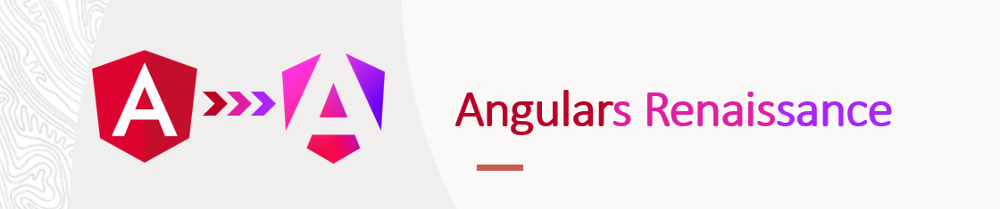

 

# Ng New 2025 - The Angular Renaissance
* By Kobi Hari (23/11/2025)

## Contact me
Please feel free to contact me for questions, or just to 
have a chat :-)
- Kobi Hari - hari@applicolors.com

## Material 

|   |    |  
|-------------- | -------------- 
| Our Projects    | [here](./projects)     |
| Our Presentation    | [here](./presentation/Ng%20New.pdf)     |

## Signals Recap
* The basics of signals
* Signal relates features through the Renaissance
* Signal Primitives
* Signal Component APIs
* Linked Signal

## Understanding Signals and Contexts
* What is Injection Context
* What is Context - In general
* How Context Switch Works
* Reactive Context
* How Signals Work - Internally

## The resource APIs in Angular 20
* The `resource` api bridges to `Promise` apis
  * Use a signal as trigger
  * Run a `Promise` function when the trigger emits
  * Tackles cases of race conditions like in a `switchMap` similar behavior
  * Supports cancellation using `AbortSignal`
  * Allows local values as well
  * Allows to "reload" the same trigger value
  * Exposes the latest value, status, error, isLoading
* The `rxResource` api bridges to `Observable`
  * No need for `AbortSignal` since observables natively support cancellation
  * Only receives the first result of every observable
  * Apart from that - is exactly the same as `resource`
* The `httpResource`
* Streaming with `resource` and with `rxResource`

## Signal Forms in Angular 21
* Creating simple forms
* Validations and Schema
* Understanding metadata in signal forms
* Reusability with Signal Forms
* Custom Controls
* Forms Submition and features
* Nested forms and arrays

